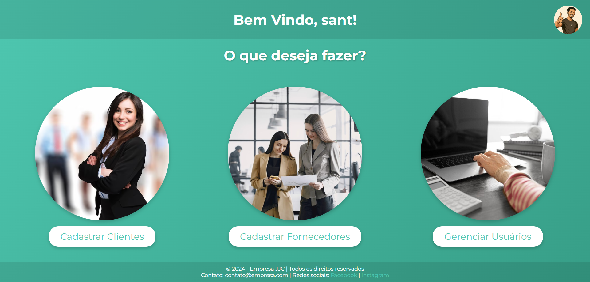
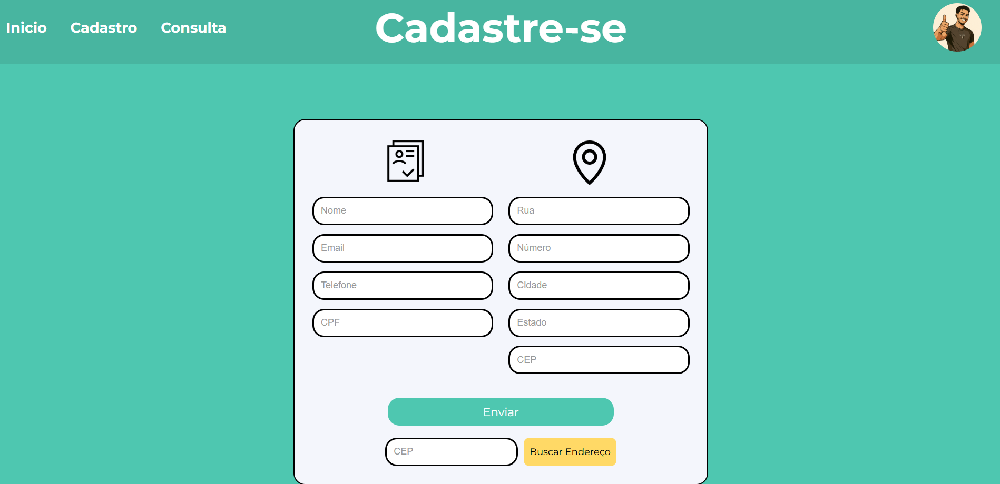
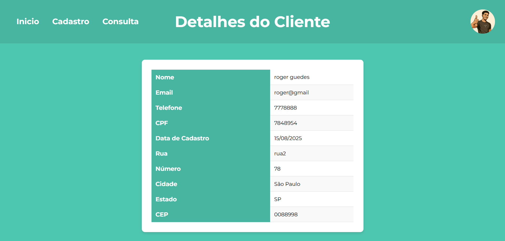

# cadastro-pessoas
---
Este repositório contém uma aplicação web de cadastro e consulta de clientes e fornecedores, desenvolvida com o microframework **Flask** em **Python**, ideal para gerenciamento comerciais.

# Demonstração Visual 🔎

